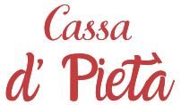

<p align="center">
  
</p>

<h1 align="center">Cassa di Pietà</h1>

<p align="center">
  Trabalho para a disciplina de <b>Linguagem de Marcação II</b>.
</p>

<p align="center">
  
  
  
</p>

---

### 👥 Integrantes

- [**Arthur Polo**](https://github.com/ArthurGpolo)
- [**Gabriel Marques**](https://github.com/njz-gabriel)
- [**Giovanne Isaac Marques**](https://github.com/GiovanneIM)

---

## 🧾 Descrição do Projeto

Nesse projeto nos foi dada a tarefa de desenvolver um site de vendas de um produtos ou serviço.

## 💡 Ideia Realizada

<p align="center">
  
</p>

Decidimos construir o sistema para um antiquario fictício para a venda de artigos antigos chamada **Cassa di Pietà**.

---

## 🛠️ Tecnologias Utilizadas

| Tecnologia | Descrição |
|-------------|------------|
| **JavaScript** | Linguagem de programação do projeto |
| **Node.js** | Ambiente de execução do Backend |
| **HTML 5** | Linguagem de Marcação do projeto |
| **CSS 3** | Estilização do site |
| **Next.js** | Framework React para o Frontend |
| **Bootstrap** | Framework CSS para estilização responsiva |

---

## 🚀 Como Executar o Projeto

```bash
  # Clone o repositório
  git clone https://github.com/GiovanneIM/antiquario.git
  
  # Entre na pasta do projeto
  cd antiquario
  
  # Entre na pasta da API
  cd api
  
  # Instale as dependências do Backend
  npm install
  
  # Inicie o servidor Backend
  node server.js
  
  # Em um novo terminal, acesse a pasta do projeto Next
  cd ../cassadipieta
  
  # Instale as dependências do Frontend
  npm install
  
  # Inicie o servidor Frontend
  npm run dev
```
Acesse o projeto em: http://localhost:3000

---

## 📂 Estrutura do Projeto
```
DunderMifflin/
│
├── api/
│   ├── server.js
│   ├── /
│   ├── /
│   ├── /
│   └── /
│
└── cassadipieta/
    ├── /
    ├── /
    └── /
```

---

## 📌 Funcionalidades

- Listagem de produtos obtidos via API
- Interface responsiva com Bootstrap
- Comunicação entre Backend e Frontend via requisições HTTP

---

<p align="center">
  Feito por <b>Arthur Polo</b>, <b>Gabriel Marques</b> e <b>Giovanne Isaac Marques</b><br>
</p>

